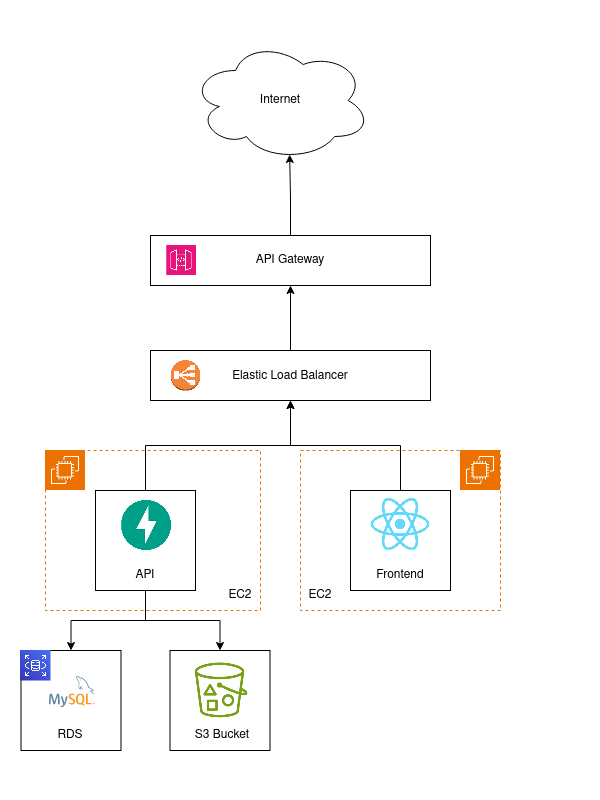

# Architecture

## Description

In our architecture, we have 4 main components:

- **Frontend**: The frontend is a React application that is served by a Node.js server. The frontend is responsible for displaying the UI to the user and sending requests to the backend. The frontend is hosted on a EC2 instance to allow for easy deployment and scalability.

- **Backend**: The backend is a FastAPI application that is served by a Gunicorn server. The backend is responsible for handling requests from the frontend and communicating with the database and the S3 bucket. The backend is also hosted on a EC2 instance.

- **Database**: The database is a MySQL database that is hosted on an RDS instance. The database is responsible for storing all the data that is used by the application.

- **S3 Bucket**: The S3 bucket is used to store all the images/files that are uploaded by the user.

In order to make our application available for multiple users, we have decided to implement the AWS elastic load balancer. The load balancer will distribute the incoming traffic to the EC2 instances that are hosting the frontend and the backend.

Finally, the elastic load balancer will be placed behind the API gateway. The API gateway will secure the application by only allowing HTTPS requests to the load balancer.

## Diagram
