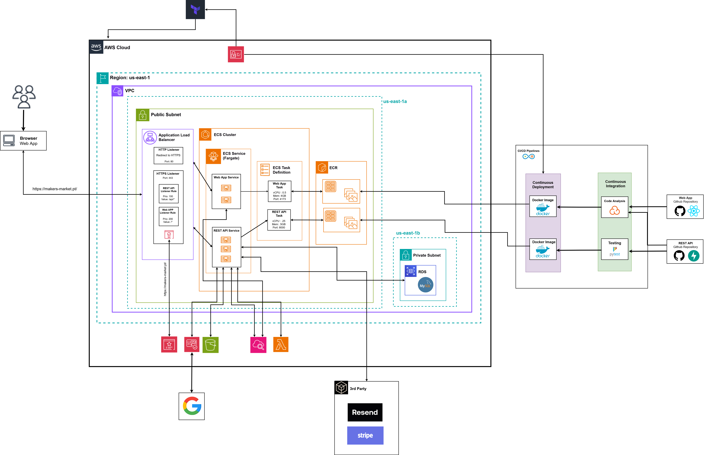
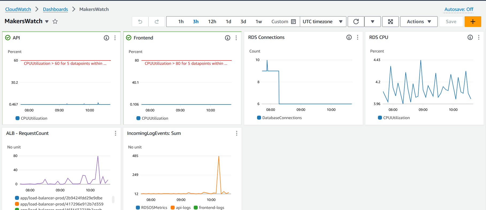

# Architecture - V2

## Description

This is the second version of the architecture. It is a more complete and complex version. In this version, we have added the following components:

- **VPC**: The VPC is used to isolate the application from the rest of the internet. It is also used to create a private subnet for the database.

- **Cognito**: Cognito is used to manage the users of the application, by providing authentication and authorization. With cognito we also added third party authentication providers such as Google.

- **Domain Name**: The domain name, created with [Dominios PT](https://www.dominios.pt/), is used to provide a friendly URL for our application.

- **Certificate Manager**: The certificate manager was used to generate a SSL certificate for our domain [Makers Market](https://makers-market.pt). This certificate is used by the Application Load Balancer to secure the application.

- **CloudWatch**: CloudWatch is used to monitor the health of the ECS Tasks by providing logs for our frontend and backend. We also added a CloudWatch dashboard to monitor the overall health of the application and the infrastructure.

- **Lambda**: Lambda is used to simulate our delivery service. It is responsible for sending timed requests to the backend to update the status of the orders.

- **Third Party Services**: We have added two third party services to our application. The first one is [Stripe](https://stripe.com/), which is used to handle the payments. The second one is [Resend](https://resend.com/), which is used to send emails to the users regarding the status of their orders.

- **ECR**: ECR is used to store the Docker images of our frontend and backend on private repositories.

- **ECS**: ECS is used to run our frontend and backend as Docker containers. 

- **Application Load Balancer**: The application load balancer is used to distribute the incoming traffic to the ECS Services that are hosting the frontend and the backend.

- **Terraform**: Terraform is used to automate the creation of the infrastructure and the deployment of the application.

For the arquitecture of the application we made the error of having the ECS Services and ECR in the public subnet. This is a security risk and we should have placed them in the private subnet. To correct this we had to correct our Terraform script to place the ECS Services and ECR in the private subnet.

## Diagram

## CloudWatch Dashboard

