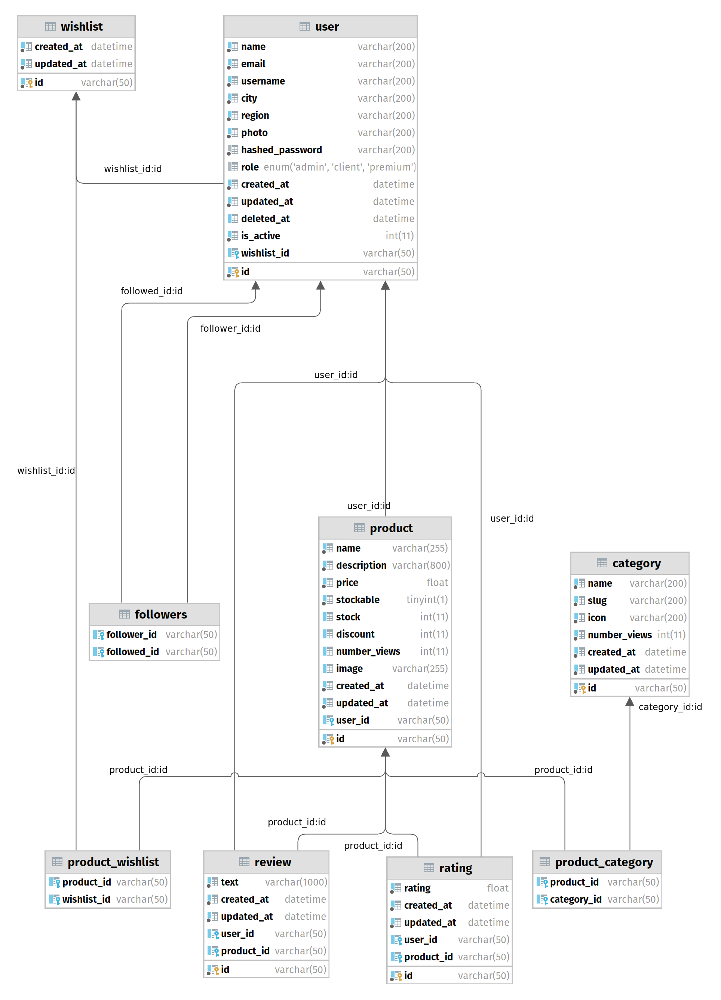

# Database model - V1

## Description

To store all our users' and products' data, as well as other entities, we implemented a relational MySQL database. 
We will go through each of these entities and their paper in our project.

### User

Our platform is expected to receive many users, which are divided mainly in "sellers" and "consumers" (***role***). Additionally, our platform has an admin which can perform higher operations to the database and other system's aspects.

Parameters such as ***name***, ***email***, ***username***, ***city***, ***region*** and ***photo*** are essential to register a user in the platform, as well as provide a ***password*** (which will be posteriorly hashed) to secure their data.

According to GDPR a user's data shall not be completely deleted from the system, and if for any reason there surges the need, may have their account disabled and unable to register again (unless there is administrator intervention). Therefore, the ***is_active*** variable stores information (true or false) whether a user can register in the platform or is forbidden to do so, with the date it no longer is active stored in ***deleted_at***.

The ***created_at*** and ***updated_at*** variables store the timestamp at which a user is created and updated, respectively.

### Product

A product is an item sold by a person to another. It consists of the value being transmitted from the consumer to the seller.

A product has parameters, such as a ***name*** (as in, a title), a ***description*** of the product and a certain base ***price***. 
Depending on its characteristics, a product has the ***stockable*** tag as true or false depending on if it has available stock (for example, a premade amount of the same product) or not (the product is made upon a user request it be made).

In case the product has the ***stockable*** tag as true, the ***stock*** variable stores the amount of available stock in each moment. Else, it is defaulted to 0.

The product also has a ***discount*** parameter which is by default 0. The final price of the product is dependent on the discount. 
For example, if a product has a base price of 20$, and a discount of 25, the final displayed price would be 20*(100-25)*0.01, which is equal, in this case, to 15$.

Each time a product is visited, its number of views (***number_views***) increase by one. At the insertion moment of the insertion of the product in the database, the number of views is 0, and each time a user visits a product, its number of views is increased. This is particularly useful to sort product by relevance since the products with more views are more relevant to other users.

A product may also have an associated photo or image(***image***) to visually appeal to users and let them know of the product's expected appearance.

The ***created_at*** and ***updated_at*** variables store the timestamp at which a product is created and updated by the consumer, respectively.

Each product is also associated with the user that sells it, using a user's ID number, ***user_id***. 

### Category

A category is an entity that encapsules different products based on their common properties. It should be modified/created only by the administrator.

The common property between products is stored as the category's ***name***, which could be, for example, Home Decoration. All products related to Home Decoration are stored in this category.

Additionally, a ***slug*** is also stored, that is, 
an identifier for our API to better search the different categories. --TBD CHECK THIS

An ***icon*** is associated with each created category to help users search visually the different categories without having to read the whole text name.

Each time a category is visited, the number of views (***number_views***) is updated by one. Upon creation, this value is 0. Its main purpose is to help users better navigate the platform and present them with the most popular categories.

The ***created_at*** and ***updated_at*** variables store the timestamp at which a category is created and updated by the administrator, respectively.

### Followers

To create greater confidence and recognition from consumers to sellers, we implemented a follower feature, in which consumers can follow a certain seller and immediately know their new available products and other news.
Therefore, the ***follower_id*** should always belong to a consumer and the ***followed_id*** should always belong to a seller.

### Wishlist

Consumers can add certain products to a wish list, to order them at a later date. 

The ***created_at*** and ***updated_at*** variables store the timestamp at which a Wishlist is created and updated by the consumer, respectively.

### Review

To let other users know about their satisfaction with a certain product, users can place a review in a product they've ordered before.

The review consists of ***text*** describing, by the consumer (***user_id***), their experience with the product they ordered (***product_id***).

The ***created_at*** and ***updated_at*** variables store the timestamp at which a review is created and updated by the consumer, respectively.

### Rating

Additionally, besides a review, a user (***user_id***) can rate a product (***product_id***), in a scale from 1 (if it's not a good product) to 5 (very satisfied with a product), stored by the ***rating*** column. 

The ***created_at*** and ***updated_at*** variables store the timestamp at which a rating is created and updated by the consumer, respectively.

## Diagram
