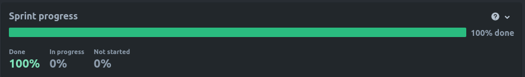
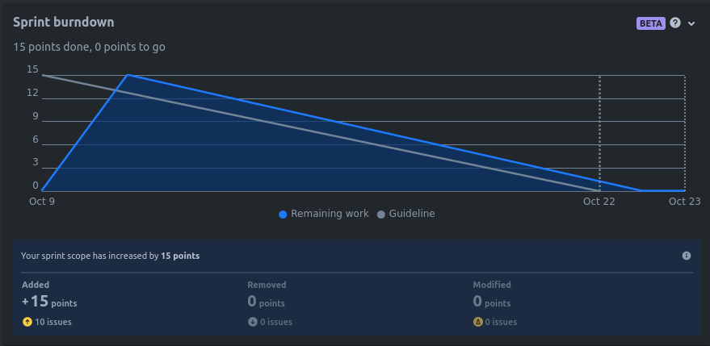

# Sprint 1

## Duration
9 October 2023 to 22 October 2023

## Attendees
Team Members

- Filipe Silveira
- Bruna Simões
- Mateus Almeida
- Vicente Barros
  - Product Owner
- Mariana Andrade
  - Scrum Master

## Sprint Goal
For our first sprint, we started the development of the project by creating a rough sketch of the database and the architecture, as well as starting the development of the frontend and backend of the project, by completing our epic ["MM-58: Product Management"](https://es-proj.atlassian.net/browse/MM-58?atlOrigin=eyJpIjoiMjliMDhjOTBlNzEyNDg0Zjg5Nzk0M2Q1ZTdlY2Q3YzAiLCJwIjoiaiJ9).

On the side, we also created the brand logo for our project and started exploring the AWS services that we will use/need for our project.

## Product Backlog Items (PBI)

### Planned PBI
- MM-10 Create rough sketch of database
- MM-11 Create rough sketch of the architecture
- MM-19 Search a Product
- MM-7 View Catalog
- MM-22 Filter Products
- MM-54 View Product
- MM-56 Create brand logo
- MM-36 Announce a Product
- MM-43 Change a Product Attributes
- MM-41 Delete Product

### Completed PBI
- MM-10 Create rough sketch of database
- MM-11 Create rough sketch of the architecture
- MM-19 Search a Product
- MM-7 View Catalog
- MM-22 Filter Products
- MM-54 View Product
- MM-56 Create brand logo
- MM-36 Announce a Product
- MM-43 Change a Product Attributes
- MM-41 Delete Product

### Incomplete PBI
- None

## Demonstrations

Our Sprint Progress was made almost linearly, with the remaining work decreasing linearly.

All tasks are also confirmed to be totally made.

Following, the images made by Jira Software after the conclusion of a sprint.

## Next Sprint

Since we faced issues in implementing authentication using the AWS Cognito, we cannot, as of now, infer about the next sprint, since it would highly revolve around user authentication and role management.

## Conclusions

We successfully managed to create the database schema, as well as introducing mock data to populate it and observe changes.

We also created different endpoints for product and category management, to comply with defined user stories.

Our frontend also encompasses different pages which display in a user friendly way methods to change and operate through products and categories alike.

In our next sprint, we should infer how we will implement authentication forms and how the chat should be implemented.