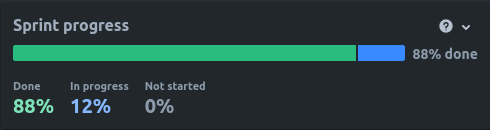
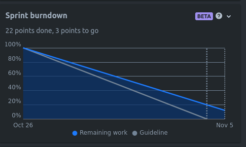

# Sprint 2

## Duration
23 October 2023 to 05 November 2023

## Attendees
Team Members

- Bruna Simões
- Filipe Silveira
- Mariana Andrade
    - Product Owner
- Mateus Almeida
    - Scrum Master
- Vicente Barros

## Sprint Goal

For our second sprint, our goal was to fully develop authentication using AWS Cognito and implement the user features of editing profile and reviewing products listed on the website.

## Product Backlog Items (PBI)

### Planned PBI
- MM-9 Edit Profile
- MM-4 Create an Account
- MM-15 Authenticate with email and password
- MM-17 Reset Password
- MM-20 View Personal Information
- MM-33 Check Reviews
- MM-29 Delete Review of Product
- MM-31 Create Review of Product
- MM-6 Authenticate with Third Party Services

### Completed PBI
- MM-9 Edit Profile
- MM-4 Create an Account
- MM-15 Authenticate with email and password
- MM-17 Reset Password
- MM-20 View Personal Information
- MM-33 Check Reviews
- MM-29 Delete Review of Product
- MM-31 Create Review of Product

### Incomplete PBI
- MM-6 Authenticate with Third Party Services

## Demonstrations

The Sprint progressed almost linearly, with a steady completion of tasks. Only one User Story was carried on to the next sprint.

Below are the graphs extracted from Jira after concluding the sprint.

## Next Sprint

For the next sprint, our goal is to begin development on the admin dashboard, as well as implement user features such as the wishlist page and the following feature.

## Conclusions

We successfully managed to complete the authentication feature, integrated with AWS Cognito and fully tested. However, we struggled to connect to third-party authentication tools, therefore that should be completed in the next sprint.

We also added the ability to add reviews to products, which was fully implemented on the frontend of the application.

For the next sprint, we will focus on completing any pending tasks and implementing user-end features such as the wishlist, as well as develop the admin dashboard for the admin role.