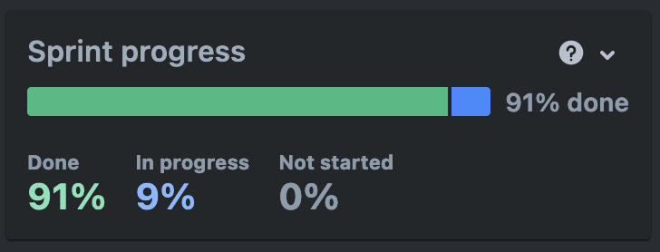
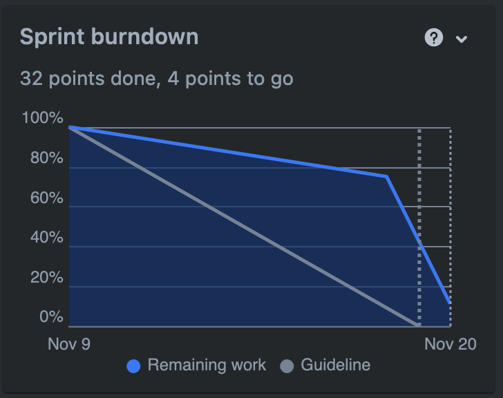

# Sprint 3

## Duration

06 November 2023 to 19 November 2023

## Attendees

Team Members

- Bruna Simões
- Filipe Silveira
    - Scrum Master
- Mariana Andrade
- Mateus Almeida
    - Product Owner
- Vicente Barros

## Sprint Goal

For our third sprint, our goal was to finish implementing features for the Buyer, such as the wishlist and shopping cart
pages, as well as the ability to follow and be followed by other users.

## Product Backlog

In one of the weekly meetings, the development team decided on reassessing the planned product backlog items after
re-evaluating what would bring the biggest value to the current sprint's increment. Therefore, the User Stories in the
Admin Dashboard epic were removed in favor of finishing the User Stories in the Product Management epic.

Moreover, it was decided unanimously to change the entities of users to the same as the sellers. This is, any user can
become a seller the moment they simply decide to start selling on the website, without needing a change in status or a
different profile. Although the persona of Buyer and Seller encompass two distinct type of users, it was agreed that
they do not have to be mutually exclusive and that the possibility of selling should not be a decision at the ends of an
administrator, but rather the end-user.

## Product Backlog Items (PBI)

### Planned PBI

- MM-6 Authenticate with Third Party Services
- MM-37 Add Item to Wishlist
- MM-39 Create Wishlist Page
- MM-35 Delete Item from Wishlist
- MM-46 Product Discount Sale
- MM-13 Rate Product in Catalog
- MM-8 Edit Product Ratings
- MM-16 Rate Seller in Catalog
- MM-12 Edit Seller in Catalog
- MM-25 Follow Seller
- MM-45 Check Seller Followers Page
- MM-21 Remove Follower
- MM-23 Filter Follower's Page
- MM-26 Consult Shopping Cart
- MM-30 Change Product in Shopping Cart
- MM-28 Delete Item from Shopping Cart
- MM-24 Add Product to Shopping Cart

### Completed PBI

- MM-37 Add Item to Wishlist
- MM-39 Create Wishlist Page
- MM-35 Delete Item from Wishlist
- MM-46 Product Discount Sale
- MM-13 Rate Product in Catalog
- MM-8 Edit Product Ratings
- MM-16 Rate Seller in Catalog
- MM-12 Edit Seller in Catalog
- MM-25 Follow Seller
- MM-45 Check Seller Followers Page
- MM-21 Remove Follower
- MM-23 Filter Follower's Page
- MM-26 Consult Shopping Cart
- MM-30 Change Product in Shopping Cart
- MM-28 Delete Item from Shopping Cart
- MM-24 Add Product to Shopping Cart

### Incomplete PBI

- MM-6 Authenticate with Third Party Services

## Demonstrations

The Sprint advanced in a nearly linear fashion, consistently accomplishing tasks. Only one User Story was carried over
to the subsequent sprint, the possibility to authenticate through third-party services.

The following graphs have been derived from Jira upon the conclusion of the sprint.

## Next Sprint

For the next sprint, our goal is to finish development on the marketplace front, which entails every remaining User
Story under the "User Statistics" and "Marketplace" epics.

## Conclusions

We successfully managed to complete the User Stories planned for this sprint, fully integrating the shopping cart,
wishlist and follower features into our product.

The team kept a steady pace of development throughout the sprint. However, there were some issues fully deploying the
application to AWS, using the Elastic Container Service, which should be addressed and resolved by the next sprint.

For the next sprint, we will focus on completing any pending tasks and refactoring api endpoints for easier
understanding of the team, all the while focusing on finishing the marketplace product for the end-user. This way, we'll
focus on integrating exterior services for the final sprint and have a fully functional, fully deployed application.