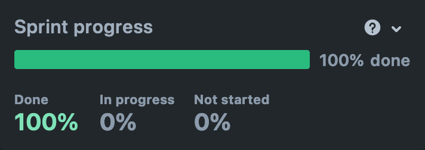
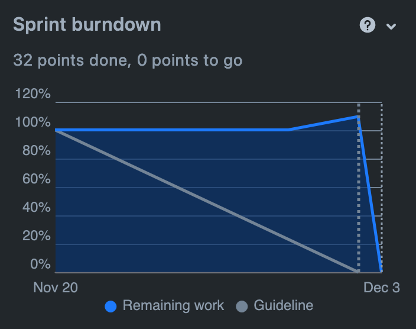

# Sprint 4

## Duration

20 November 2023 to 04 December 2023

## Attendees

Team Members

- Bruna Simões
  - Scrum Master
- Filipe Silveira
  - Product Owner
- Mariana Andrade
- Mateus Almeida
- Vicente Barros

## Sprint Goal

The goal for this sprint was to finish the checkout feature, to allow users to be able to complete their orders, as well as implement Premium user features, such as user statistics. 

## Product Backlog Items (PBI)

### Planned PBI

- MM-75 Refactor API
- MM-34 Order History
- MM-73 Filter Order History
- MM-50 Premium - Seller Statistic's Page
- MM-52 Premium - Buyer Statistics Page
- MM-60 Premium - Buy Premium
- MM-74 Premium - Unlimited ads
- MM-38 Enable or Disable Product
- MM-51 Perform Payment
- MM-14 Order a Product

### Completed PBI

- MM-75 Refactor API
- MM-34 Order History
- MM-73 Filter Order History
- MM-50 Premium - Seller Statistic's Page
- MM-52 Premium - Buyer Statistics Page
- MM-60 Premium - Buy Premium
- MM-74 Premium - Unlimited ads
- MM-38 Enable or Disable Product
- MM-51 Perform Payment
- MM-14 Order a Product

### Not Completed PBI
- MM-6 Authenticate with Third Party Services

## Demonstration

The Sprint advanced in a nearly linear fashion, consistently accomplishing tasks. Only one User Story was carried over
to the subsequent sprint, the possibility to authenticate through third-party services.

The following graphs have been derived from Jira upon the conclusion of the sprint.

## Sprint Review

We successfully manage to complete all the User Stories on the Sprint Backlog, completing the User Stories on the User Statistics and Marketplace epics. It was decided to use Stripe API to safely conclude the payment.

User Stories relevant to the Checkout and Payment features were also rewritten in order to clearly convey what is the Acceptance Criteria for each User Story.

We officially deployed the product using solely AWS Services and obtained an official [Maker's Market](https://makers-market.pt/) domain.

## Next Sprint Planning

For the next sprint, we intend on closing some pending issues on both the front-end and the back-end side of the application, such as issues with user's own uploaded images. There will also be some refactoring issues on the UI and branding of the product.  

It is also our goal to allow users to have live tracking of their orders and to finally conclude the feature of authenticating with third-party services. As the last sprint, all tasks and User Stories will be Done.