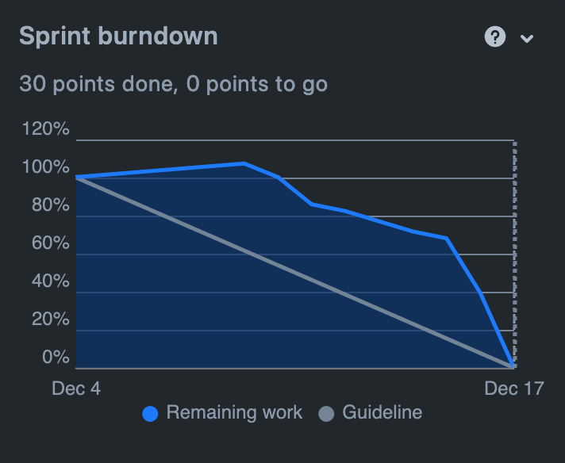
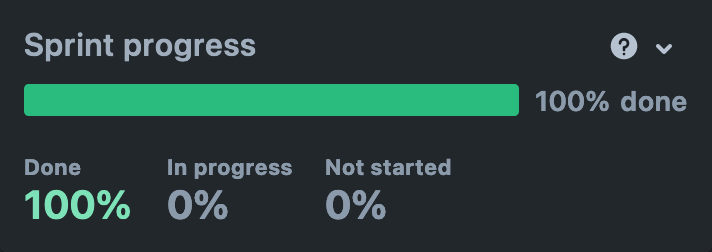

# Sprint 5

## Duration

04 December 2023 to 17 December 2023

## Attendees

Team Members

- Bruna Simões
    - Product Owner
- Filipe Silveira
- Mariana Andrade
- Mateus Almeida
- Vicente Barros
    - Scrum Master

## Sprint Goal

The goal for this sprint was to conclude the remaining unimplemented User Stories, such as the User Product's review page, the tracking of orders and the possibility of authenticating through third-party services. Moreover, a lot of refactoring was done on both the back-end of the product, as well as the front-end and documentation.

## Product Backlog Items (PBI)

### Planned PBI

- MM-6 Authenticate with Third Party Services
- MM-49 Check Seller's Product Review Page
- MM-76 Fix endpoints structure
- MM-78 Fix Upload images issue
- MM-79 Colour Redesign & UX fixes
- MM-80 Track my order
- MM-81 Reorganise the rating logic
- MM-83 Redesign Docussaurus Frontend
- MM-84 Automate Insert Data
- MM-85 Fix Security Hotspot
- MM-87 Fix Stripe calls in the frontend

### Completed PBI

All planned PBIs were completed within this sprint.

### Not Completed PBI

None.

## Demonstration

The demonstration section provides a visual representation of the progress and achievements made during the sprint. The following graphs have been derived from Jira upon the conclusion of the sprint.

 
This burndown chart showcases how the team managed to complete the workload steadily over the sprint period and highlights the efficiency in handling tasks and adhering to the sprint timeline.

The progress bar indicates that 100% of the tasks were completed, emphasizing a successful sprint with all items moving from 'To Do' to 'Done' without any work in progress or not started by the end of the sprint.

## Sprint Review

The completion of Sprint 5 marks a significant milestone in our project, as we successfully achieved the sprint goal of implementing critical User Stories and completed the first major cycle of development for our product.

The integration of third-party authentication was a pending issue lasting multiple sprints and the team had to address issues related to API compatibility and security protocols. Another significant challenge was the implementation of the photo upload feature. We encountered several errors when connecting to AWS services, which hindered our progress. However, through persistent troubleshooting and leveraging the expertise of our team members, we successfully resolved these issues. 

The experiences of this development cycle have provided us with valuable insights into the resilience and adaptability of our team and as individuals. As we move forward, the lessons learned will be instrumental in guiding our approach to future challenges. Moreover, the team also deepened our appreciation for the Scrum values of commitment, courage, focus, openness, and respect. Each team member's dedication to these principles has been pivotal in our ability to meet every sprint goal and conclude development of our solution.

